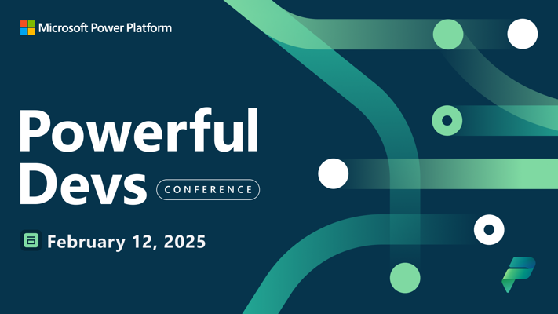

# Powerful Dev Conference 2025 - Proposed Testing Session

To help tailor the submission we are Crowd sourcing submission for Powerful Dev Conference 2025. We’d love to hear your thoughts and suggestions! What specific challenges have you faced with automated testing in the Power Platform? Are there particular topics or examples you’d like us to cover? Your feedback will help shape a session that truly meets the needs of our community. Let’s collaborate to make this session as impactful and relevant as possible! 🚀

## Important Note on Early Development Features

Please be aware that this session relates to a [build-from-source](./examples/coe-kit-build-from-source-run-tests.md) strategy with features that are not yet released as part of the Power Apps Test Engine. We are specifically using examples from the [CoE Starter Kit Setup and Upgrade](./examples/coe-kit-setup-and-install-wizard.md) to work with the Test Engine team to collaborate and shape the features of the Power Apps Test Engine.

Specific features or concepts discussed in this session and repository still need to be reviewed and approved before they will be included as features available as part of the `pac test run` Power Platform Command Line Interface. This means that some features are experimental and subject to change. 

We encourage you to provide feedback and suggestions to help shape these features as they progress towards stable releases. Your input is invaluable in ensuring that the final implementations meet the needs of the community and adhere to best practices.

## Proposed Session

**Session Due:** October 30

**Session Status:** Submitted

## How to contribute and keep up to date:

Comment on [Linked In](https://www.linkedin.com/pulse/powerful-devs-conference-low-code-testing-grant-archibald-xwjac/) with your thoughts to join one of the [discussion](./discussion/) threads in the Issues section of the repository. 

You can also you your GitHub account to login then use the notification and star buttons to watch the repository and give feedback if these topics are important to you and your organization.

## Session Title

Mastering Automated Testing in Power Platform: From Unit Tests to CI/CD Integration

## Presenter

[Grant Archibald](https://www.linkedin.com/in/grantarchibald/) - Collaborator and Contributor to Test Engine

Microsoft Program Manager

Power CAT Engineering

## Abstract

Join us at the Powerful Devs Conference 2025 for an in-depth session on automated testing within the Power Platform. This session will address the common challenges of automated testing in projects and provide valuable insights into pragmatic approaches for testing and monitoring both low-code and pro-code solutions. Learn how to build robust applications, flows, and Copilot solutions with comprehensive unit and integration tests. Discover how to integrate quality and review gates into your CI/CD process, perform operational checks, and validate system dependencies. We will also explore how to apply engineering excellence principles to both code-first and low-code development.

## Possible Topics

Topics that could be discussed include:
1. Building Apps, Flows, and [AI](./discussion/generative-ai.md) with Unit/Integration Tests: Learn how to create and implement unit and integration tests for your Power Apps, Power Automate flows, and AI solutions.

2. [Integrating Quality and Review Gates in CI/CD](./examples/coe-kit-test-automation-alm.md): Understand how to build in quality and review gates that fit seamlessly with your CI/CD process.

3. [Operational Checks and System Validation](./examples/coe-kit-test-automation-alm.md): Explore methods for performing operational checks and validating system dependencies to ensure reliability.

4. Engineering Excellence for Code-First and Low-Code Makers: Apply engineering excellence principles to enhance the [sustainability](./discussion/building-a-sustainability-model.md), quality and [maintainability](./examples/coe-kit-infrastructure-as-code.md) of your solutions.

5. Real-World Examples from the CoE Kit: Gain insights from real-world examples of automating the installation and testing of various [Power Apps](./examples/coe-kit-extending-test-engine.md), [Power Automate](./examples/coe-kit-powerautomate-testing.md), Dataverse, and [AI components](./discussion/generative-ai.md) within the CoE Kit.

## Tell Me More

[Power Apps Test Engine - GitHub Repo](https://github.com/microsoft/PowerApps-TestEngine) with open source implementation of Power Apps Test Engine

Review [Discussion topics](./discussion/) to give us feedback and get involved with topics of interest to you

Have a look at [Examples](./examples/) on concepts and how we have applied Automated Testing with low code solutions like the CoE Starter Kit.