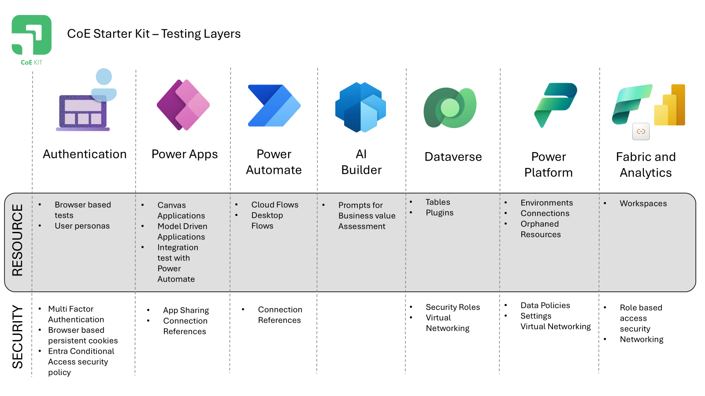
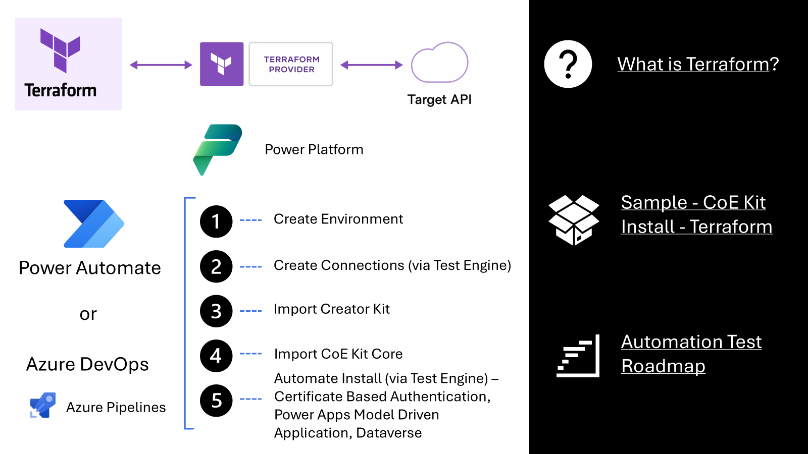
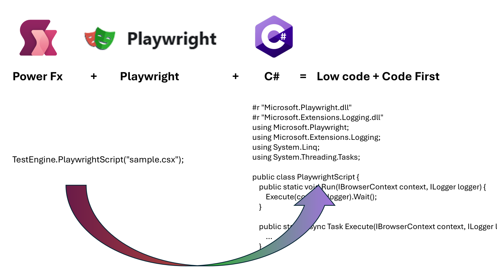

# Overview

This section provides examples of applying automated tests and explaining concepts when using the Power Apps Test Engine

## CoE Starter Kit Test Context

| Preview | Example | Description |
|---------|---------|-------------|
|  | [Executing CoE Starter Kit Test Automation ](./coe-kit-automate-test-sample.md) | The CoE Starter Kit Test Automation has started with the Setup and Upgrade Wizard. This exaample extends to various components like Browser Login, Model-Driven and Canvas Apps, Power Automate Features, Cloud Flows, Desktop Flows, AI Builder Prompts, Database Setup, Power Platform, and Microsoft Fabric and Power BI. The process involves configuring the environment, authenticating via the Power Platform CLI, building the latest version of the Power Apps Test Engine, and managing browser-based authentication to support multi-factor authentication and ensure compliance with organizational security policies.
|  | [Example: CoE Kit Setup and Install Wizard](./coe-kit-setup-and-install-wizard.md) | The CoE Kit Setup and Install Wizard example highlights the importance of automated testing for ensuring a consistent and reliable setup process. By collaborating with the Test Engine team and leveraging Power Platform Terraform provider, the team has been able to automate the setup, handle Power Apps testing and beyond and extend testing capabilities, ultimately improving the reliability and efficiency of the testing framework. |

## Getting Started

| Example | Description |
|---------|-------------|
| [CoE Kit - Build from Source Example](./coe-kit-build-from-source-run-tests.md) | The Power Platform Center of Excellence (CoE) starter kit includes various low-code solution elements, such as a model-driven application for setting up and upgrading the kit. This example demonstrates how to build from source using the open-source version of the Test Engine to automate and verify key aspects of the Setup and Upgrade Wizard.

## Example Concepts

| Preview | Example | Description |
|---------|---------|-------------|
| | [Extending the Test Engine to Support Testing of the CoE Starter Kit Setup and Upgrade Wizard](./coe-kit-extending-test-engine.md) | The CoE Starter Kit has extended the test engine to support testing of the Setup and Upgrade Wizard by breaking down tests into smaller steps, using variables and collections, and leveraging the Experimental namespace to overcome limitations. This approach ensures thorough and reliable testing, leading to a more robust and user-friendly application.
|  | [CoE Starter Kit Test Automation ALM](./coe-kit-test-automation-alm.md) | The CoE Starter Kit Test Automation ALM aims to maintain quality and reduce manual effort for new releases by automating the release and continuous deployment process. This involves using tools like Power Automate Desktop, Terraform, and the Test Engine to provision environments, install dependencies, and validate setups, ensuring consistent and reliable operations.
|  | [CoE Starter Kit -  Infrastructure As Code](./coe-kit-infrastructure-as-code.md) | The combination of Terraform and the CoE Starter Kit offers a robust solution for managing Power Platform environments by leveraging infrastructure as code to ensure consistency and reliability. This approach simplifies the setup and maintenance of environments, allowing us to create the foundations of an automated test matrix to test setup and upgrade process. 
|  | [Testing Variables and Collections in Power Apps with the Test Engine](./custom-page-variables-and-collections.md) | The Test Engine in Power Apps offers robust capabilities for testing variables and collections, simplifying application state management. By leveraging the Set() function, developers can directly change the state of the application, making it easier to verify functionality and handle various scenarios.
|  | [CoE Starter Kit Power Automate Testing](./coe-kit-powerautomate-testing.md) | The CoE Starter Kit Power Automate Testing feature is in the early stages of planning and aims to address the needs of users building and deploying Power Automate Cloud flows. Proper testing of these flows is crucial for maintaining accurate data collection and reporting, which supports better decision-making and governance within the organization
|   | [Extending TestEngine Power FX with C# Test Scripts](./extending-testengine-powerfx-with-with-csharp-test-scripts.md) | The extensibility of TestEngine Power FX using C# test scripts allows developers to integrate web-based Playwright commands through code-first extensibility, enhancing browser automation capabilities. This approach enables the creation of custom test scripts that leverage Playwright's powerful features, improving productivity and maintainability by focusing on high-level test logic while handling common code efficiently
|  | [Understanding the "No Cliffs" Extensibility Model of Power Apps Test Engine](./understanding-no-cliffs-extensibility-model.md) | The "no cliffs" extensibility model of Power Apps Test Engine ensures that users can extend its capabilities without encountering barriers, providing a seamless experience for both makers and developers. By leveraging Power FX and C# test scripts, this model simplifies handling complex scenarios like Power Apps consent dialogs to enhancing the efficiency and reliability of the testing process
|  | [Using Power Fx Namespaces in Testing](./using-powerfx-namespaces-in-testing.md) | Power Fx namespaces allow developers to organize and separate different sets of functions within the language, helping to maintain clarity and avoid conflicts. By distinguishing between common features and specific actions, and separating stable features from experimental ones, namespaces ensure the stability and reliability of Power Apps.