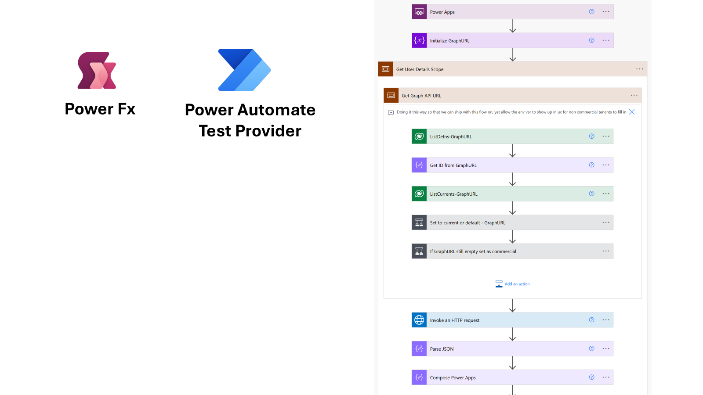
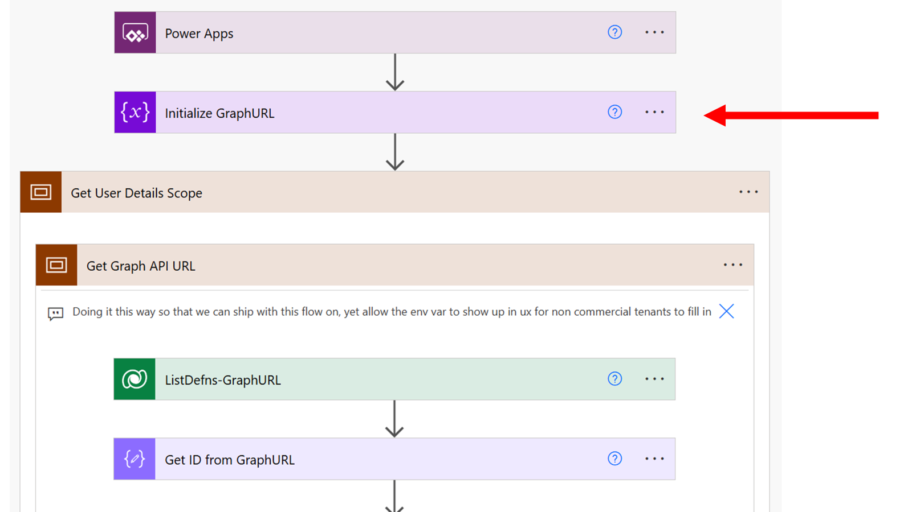
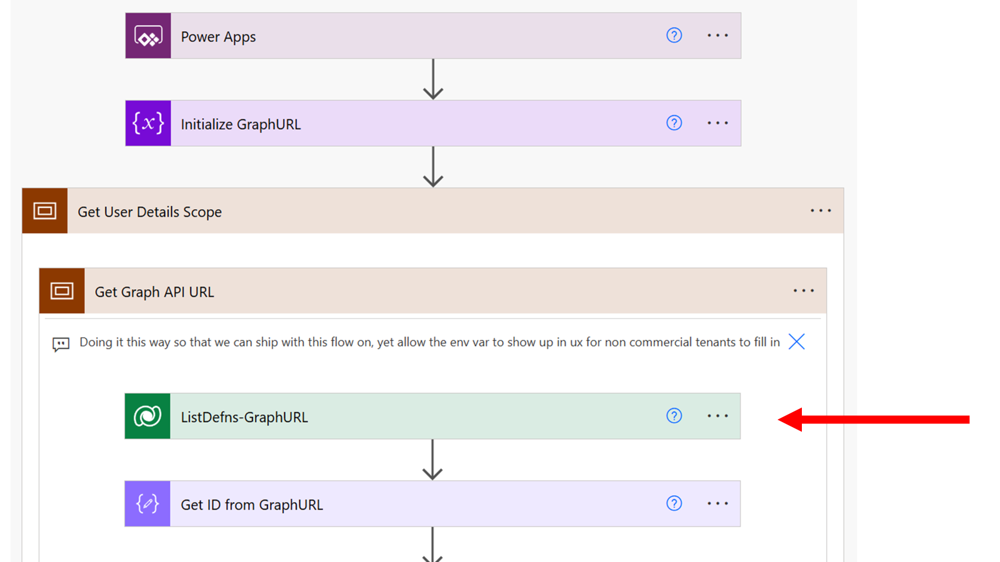
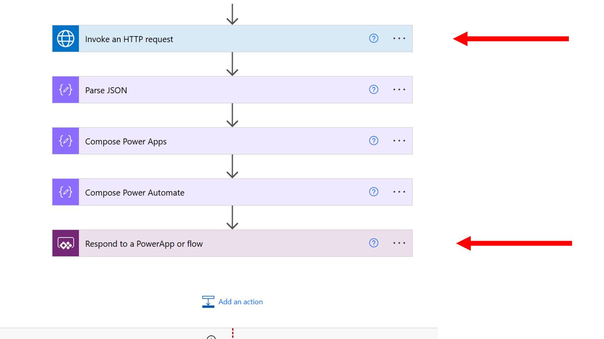

# CoE Starter Kit Power Automate Testing

## Important Note

The CoE Starter Kit Power Automate Testing feature is currently in the planning and early collaboration and code contributions to Test Engine for the approach outlined below. 

This article aims to serve as a starting point for discussion on how this feature could meet the needs of users who are building and deploying Power Automate Cloud flows. It is important to note that this feature is still in the early stages of planning and experimentation. We invite the community to be part of the discussion and to stay aware as the scope and features develop.

## Importance of Testing Power Automate in the CoE Starter Kit

Testing Power Automate is crucial for the CoE Starter Kit, which has over 100 cloud flows defined to collect inventory and usage data for the tenant. Ensuring these flows work correctly is essential for maintaining accurate data collection and reporting. Proper testing helps identify and fix issues early, improving the reliability and performance of the flows. This, in turn, supports better decision-making and governance within the organization.

## Integration Testing from Power App

One of the key concepts is integration testing from Power App. This starts with testing the Setup and Upgrade Wizard and using the `Experimental.SimulateWorkflow()` function to allow integration testing of a deployed application.

## Example of Setup Wizard > Get User Details

### Testing from Power App

One of the steps of the tests for the Power App for could be the following. 

```powerfx
Experimental.SimulateWorkflow({
    Name: "SetupWizard>GetUserDetails",
    Then: {haspowerapps:"Yes",haspowerautomate:"No"}
});
```

This action would allow requests to the workflow to be replaced with a value provided as part of the test case definition. 

### Testing the Power Automate Cloud Flow Actions

While the step above is useful for testing the Power App how would we test the actions withing this workflow? Let have a look at the definition of the cloud flow and how it could fit into the Test Engine



The `SetupWizard>GetUserDetails` flow determines if the current user has licenses for Power Apps and Power Automate. Lats have a look at the the key steps of the Power Automate Flow. 



The flow is triggered from Power Automate and creates a variable to determine the graph endpoint to use. This process queries an environment variable to get an environment value if defined. If not, it defaults to the commercial cloud endpoint of `https://graph.microsoft.com`. 



Having found the correct graph endpoint, it then calls the graph API to query the license details assigned to the user to determine if the correct Power Apps and Power Automate License has been assigned.



The need to test scenarios like these leads us to consider extending Test Engine to introduce a new Provider for Power Automate that allows unit testing of Power Automate Cloud flows. This would validate the logic by enabling the validation of variable values and the simulation of connectors and Dataverse calls.

## Extended Power Fx Test Steps for Power Automate Testing

Let's have a look at how this cloud flow could be tested using Test Engine:

```powerfx
// Start the workflow with empty parameters
Experimental.TriggerWorkflow({});

// Verify empty value
Experimental.BeforeAction([Get User Details Scope], Assert(GraphUrl, ""));

// Simulate calls to dataverse and connectors with sample data
Experimental.SimulateDataverse({
    Action: "Query",
    Entity: "Environment Variable Definitions",
    Then: Table({environmentvariabledefinitionid: "a1234567-1111-2222-3333-44445555666" })
});
Experimental.SimulateDataverse({
    Action: "Query",
    Entity: "Environment Variable Values",
    Then: Table({Value: "https://graph.microsoft.com" })
});
Experimental.SimulateConnector({
    Name: "webcontents",
    Then: Table({id: "11111111-0000-0000-0000-22222222222", skuId: "", skuPartNumber: "POWERAPPS_PER_USER" })
});

// Verify selected Graph endpoint and Results of the flow
Experimental.BeforeAction([Invoke an HTTP request], Assert(GraphUrl, "https://graph.microsoft.com"));
Experimental.AfterAction([Respond to a PowerApp or flow],Assert([Respond to a PowerApp or flow].haspowerapps = "Yes"));
Experimental.AfterAction([Respond to a PowerApp or flow],Assert([Respond to a PowerApp or flow].haspowerautomate ="No"));
```

 Power Fx Function                | Parameters                                                                 | Usage                                                                                                      |
|----------------------------------|----------------------------------------------------------------------------|------------------------------------------------------------------------------------------------------------|
| Experimental.TriggerWorkflow()   | {}                                                                         | Triggers the workflow to start the testing process.In this case with no parameters,                                                       |
| Experimental.BeforeAction()      | [Action], Assert(Parameter, Value)                                         | Executes assertions before a specified action to ensure the initial conditions are met.                    |
| Experimental.SimulateDataverse() | { Action: "Query", Entity: "EntityName", Then: Table({Column: "Value"}) }  | Simulates a Dataverse query to return predefined values, allowing the testing of logic that depends on Dataverse data. |
| Experimental.SimulateConnector() | { Name: "ConnectorName", Then: Table({Column: "Value"}) }                  | Simulates a connector call to return predefined values, enabling the testing of logic that depends on external connectors. |
| Experimental.AfterAction()       | [Action], Assert(Parameter, Value)                                         | Executes assertions after a specified action to ensure the expected outcomes are achieved.                 |

By being able to interact with variable values and simulate connectors and Dataverse calls, the process of testing the control logic and error handling of a cloud flow becomes easier.

## Summary

This proposed feature demonstrates the ability to use Power Fx as a common language to not only test Power Apps but other Power Platform components. This builds on the extensibility of Power Fx to add new actions like Experimental.TriggerWorkflow(), Experimental.BeforeAction(), and Experimental.AfterAction() that apply when testing a Power Automate Cloud flow.
