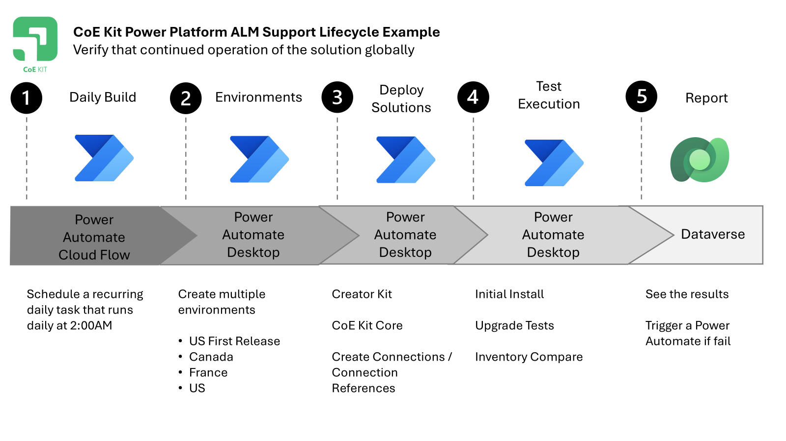

# CoE Starter Kit Test Automation ALM

The goal of implementing the following stages is to maintain the quality and reduce the manual effort for new releases of the CoE Starter Kit. This article will discuss the key topics in a narrative conversation style.

## CoE Kit - Power Platform Low Code ALM Release and Continuous Deployment Process

When it comes to automating the release and continuous deployment process for the CoE Starter Kit, there are several options to consider. 

### Automation Options

You can use a physical machine, such as a laptop or PC, to run your automation scripts. Alternatively, you can trigger these scripts from cloud flows or pipelines, providing more flexibility and scalability.

#### Authoring Options

For authoring your tests, you have a few choices. You can use [Test Studio Export](https://learn.microsoft.com/power-apps/maker/canvas-apps/test-studio) and Visual Studio Code, or even the [Playwright Inspector](https://playwright.dev/docs/debug#playwright-inspector) to investigate and use [no cliff extensions](./understanding-no-cliffs-extensibility-model.md). This allows you to focus on the test actions of the Power App rather than the process around it.

Test can be locally run on your development machine. 

The tests can optionally also execute via Power Automate desktop to ensure that the process works with cloud hosted options. 

#### Licenses

To run and execute Power Automate Desktop using a hosted configuration using only Power Platform resources this examples needs a Power Automate license. 

For organizations with Conditional access policies for authentication, you can use a Microsoft Intune Joined Windows 11 Cloud hosted PC to execute Desktop flows. This setup requires a Power Automate Hosted Process license and an Intune license, such as Intune Plan 1 or Microsoft 365 Business Premium.

#### Code First Approach

For those who prefer a code-first approach, an Azure DevOps license and a Windows Custom Build Agent can be used to manage the automation process.

## CoE Kit – Automated Install and Test Example

Let's dive into an example of automated installation and testing using Power Automate Desktop, Terraform, and the Test Engine.

### Provisioning Tools

Power Automate Desktop actions are used to provision the required tools for a "build from source" strategy. This involves setting up actions to run custom scripts and commands to prepare the environment.

### Setup Process

The setup process makes use of Terraform to provision the environment and install dependencies like the Creator Kit. Once the environment is ready, the Test Engine tests are executed to validate the setup.

## CoE Kit – CoE Kit Power Platform ALM Support Lifecycle Example

This example demonstrates how to support the lifecycle of the CoE Kit using low-code Power Platform and Power Automate components. An alternative, more code-first approach could be achieved using an Azure DevOps pipeline.

By following these stages, we aim to maintain the quality of the CoE Starter Kit and reduce the manual effort required for new releases.

### Verify Continued Operation

To ensure the continued operation of the solution globally, a daily build process is implemented. This starts with a Power Automate Cloud Flow that schedules a recurring daily task at 2:00 AM.

### Environment Setup

Terraform is used to create environments globally, allowing the kit to be tested in multiple settings. The CoE Starter Kit and its dependencies are then deployed, along with the necessary connections.

### Test Execution and Reporting

The Test Engine tests are run on Power Automate Desktop, and the results are uploaded to Dataverse. This allows for reporting on the success or failure of the build, ensuring that any issues are quickly identified and addressed.
