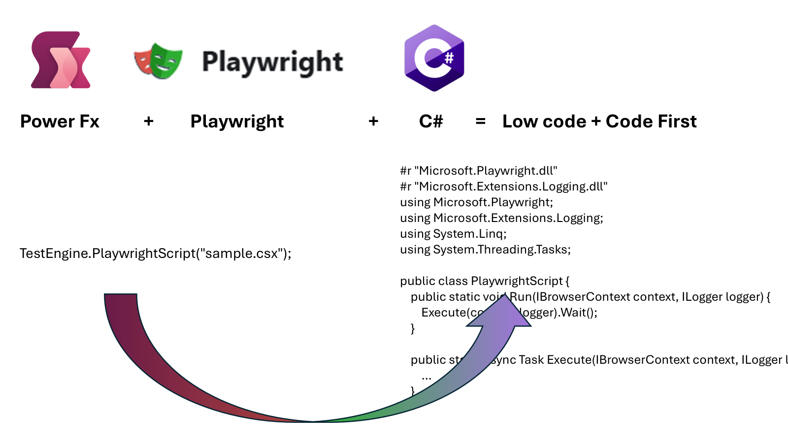

# Extending TestEngine Power FX with C# Test Scripts

## Introduction

In this example, we explore the extensibility of TestEngine Power FX using C# test scripts. We will delve into the extensibility model of TestEngine, focusing on the integration of web-based Playwright commands through code-first extensibility. 

We will discuss extending the code-first extensibility of web-based Playwright commands. This approach enables developers to write custom test scripts that leverage the powerful capabilities of Playwright for browser automation.

Providers in TestEngine understand the underlying model of the component being tested. They create Power FX abstractions that hide complexity, allowing testers to focus on the high-level logic of their tests. To allaow code first extension the ```Experimental.PlaywrightScript()``` Power FX function allows scripts to be recorded or authored in C# to extend the test.



## Extensibility Model of TestEngine

TestEngine offers an extensibility model for Authentication, Providers, and Power FX functions as MEF (Managed Extensibility Framework) modules. This allows developers to extend and customize the testing framework to meet specific needs.


## Benefits of TestEngine

By using TestEngine, developers can handle common code efficiently and focus on specific code-first extensions for their tests if required. This separation of concerns enhances productivity and maintainability.


## "No Cliffs" extensibility with C#

TestEngine provides the ability to "no cliffs" extension with C# to interact with Playwright. This feature allows developers to write custom C# code for scenarios where Power FX alone is insufficient. 

One powerful combination is using the C# script with the `Experimental.Pause()` command. This function pauses the test execution and displays the Playwright Test Explorer. From the Playwright Test Explorer, developers can inspect the state of the web page, which is invaluable for debugging and understanding the current state of the application under test.

Additionally, the Playwright Test Explorer offers the capability to record actions performed on the web page. These recorded actions can then be converted into C# scripts, which can be integrated back into the test. This feature streamlines the process of generating parts of the C# script, making it easier to create accurate and efficient test scripts.

By leveraging `Experimental.Pause()`, developers can:
- **Inspect Web Page State**: Pause the test to examine the current state of the web page, helping to identify issues and verify that the application is behaving as expected.
- **Record C# Scripts**: Use the Playwright Test Explorer to record interactions with the web page. These interactions can be automatically converted into C# code, reducing the manual effort required to write test scripts.
- **Enhance Debugging**: The ability to pause and inspect the test execution provides a powerful debugging tool, allowing developers to quickly identify and resolve issues.

## Power FX as an Extensible DSL

This examples how Power FX provides a powerful capability to act as an extensible domain-specific language (DSL) to encapsulate testing content. This flexibility makes it a powerful tool for writing and maintaining test scripts using both low code PowerFX and code first C# scripts together.


## Overview with Experimental.PlaywrightScript()

To illustrate the integration, we explain how the process works with `Experimental.PlaywrightScript("sample.csx")` works:

- **Compile the Code Using Roslyn**: The script is compiled using the [Roslyn compiler](https://learn.microsoft.com/dotnet/csharp/roslyn-sdk/), ensuring that the C# code is executed efficiently.
- **Implement Defined C# Class**: The compiled code implements a defined C# class that will be called from the Power FX script, enabling seamless interaction between the PowerFX code and the C# and .Net components.

## Example Script

A examplof of using `Experimental.PlaywrightScript()` is in [testPlan.fx.yaml](https://github.com/microsoft/PowerApps-TestEngine/blob/grant-archibald-md/integration-merge/samples/playwrightscript/testPlan.fx.yaml)